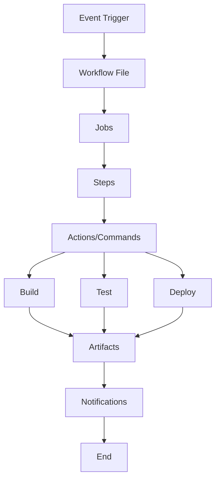

# github-actions-crash-course

```mermaid
graph TD
  A[Event Trigger] --> B[Workflow File]
  B --> C[Jobs]
  C --> D[Steps]
  D --> E[Actions/Commands]
  E --> F[Build]
  E --> G[Test]
  E --> H[Deploy]
  F --> I[Artifacts]
  G --> I[Artifacts]
  H --> I[Artifacts]
  I --> J[Notifications]
  J --> K[End]

```
